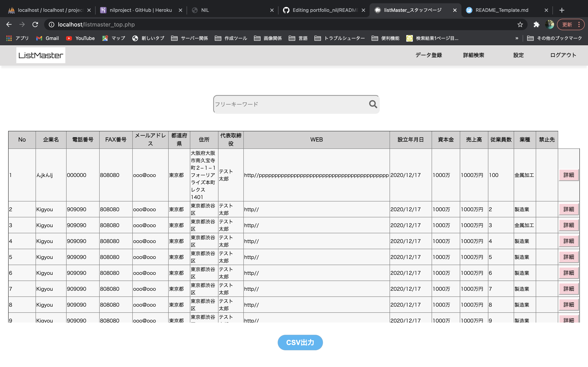
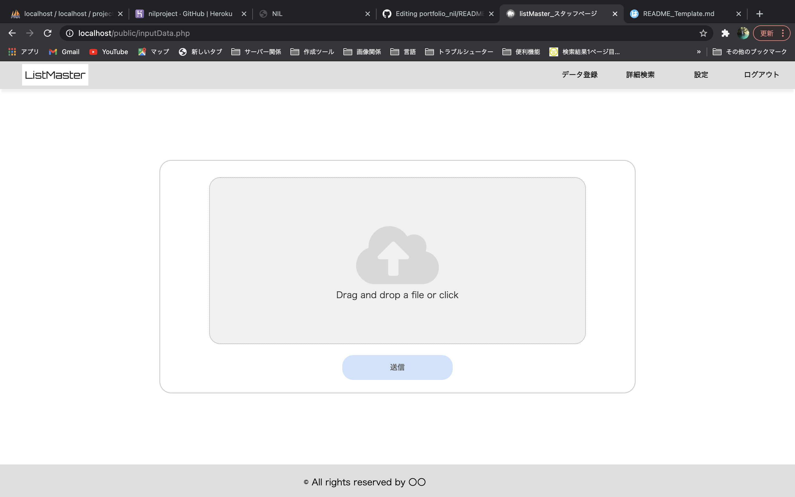
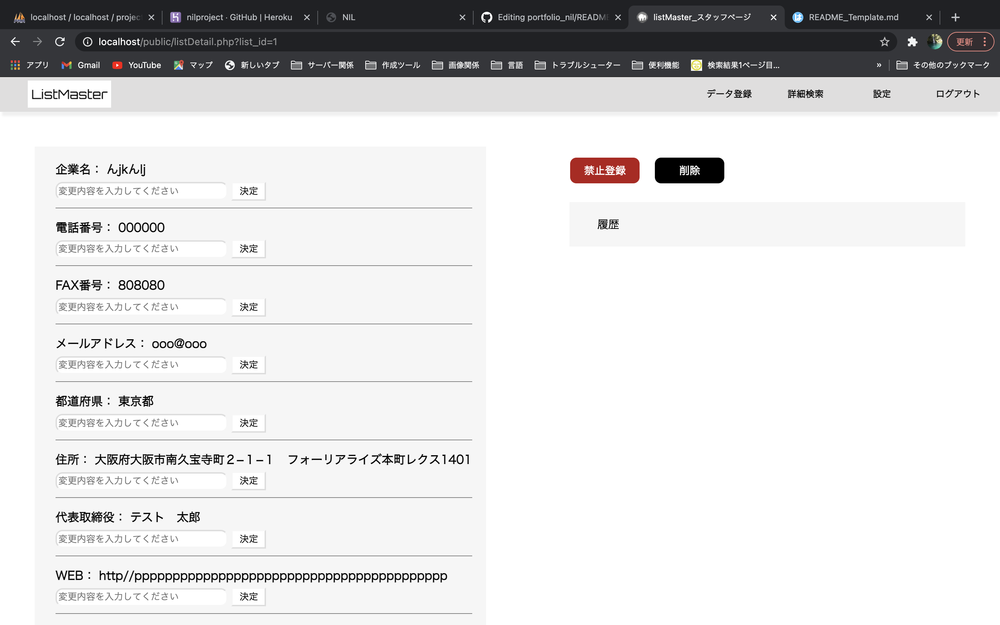

# LISTMASTER

営業管理が出来るアプリです。

## 簡単な説明
 
WEBアプリ内で、CSVのリストデータを登録、出力が出来、
またフリーワードでの条件を絞った検索、抽出も可能です。
加えてアプローチを行う中で営業禁止先の登録が出来る為、
本アプリを通して営業部全体のアプローチ管理が可能です。
 
***デモ***
[デモ1] 
[デモ2] 
[デモ3] 

## 機能
 
- CSVファイルの入力、出力
- フリーワード検索機能
- アプローチ禁止先の登録、管理
 
## 使い方
 
1. ヘッダーのリスト登録からCSVを選択で登録可能
2. TOPのCSVダウンロードより表示されているデータを全て取得可能
3. 詳細ボタンより禁止、削除登録が可能（※未完成です）
 
[@hal543]
zet543gr@icloud.com
